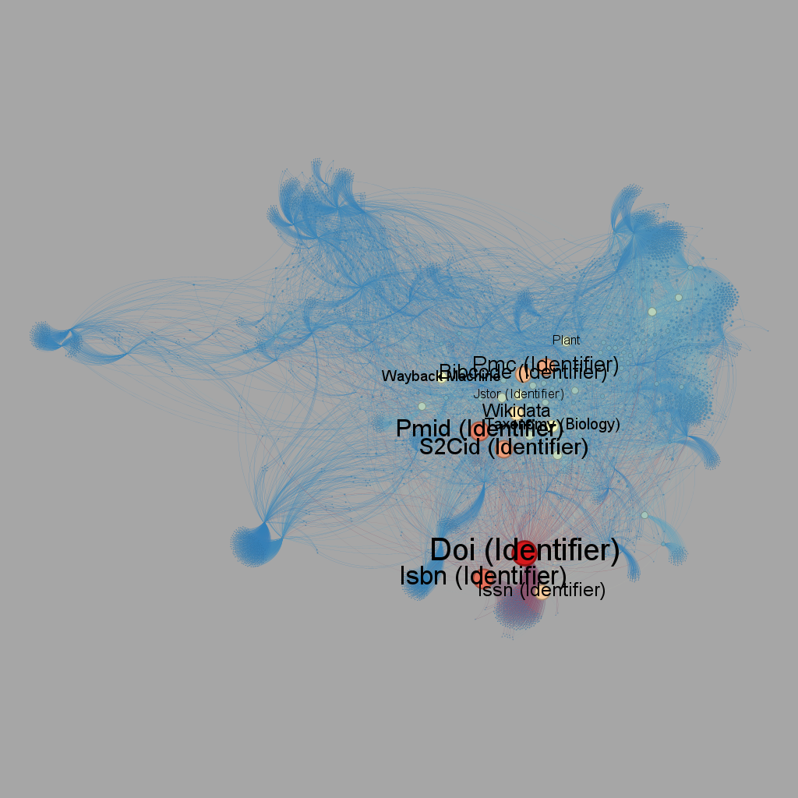
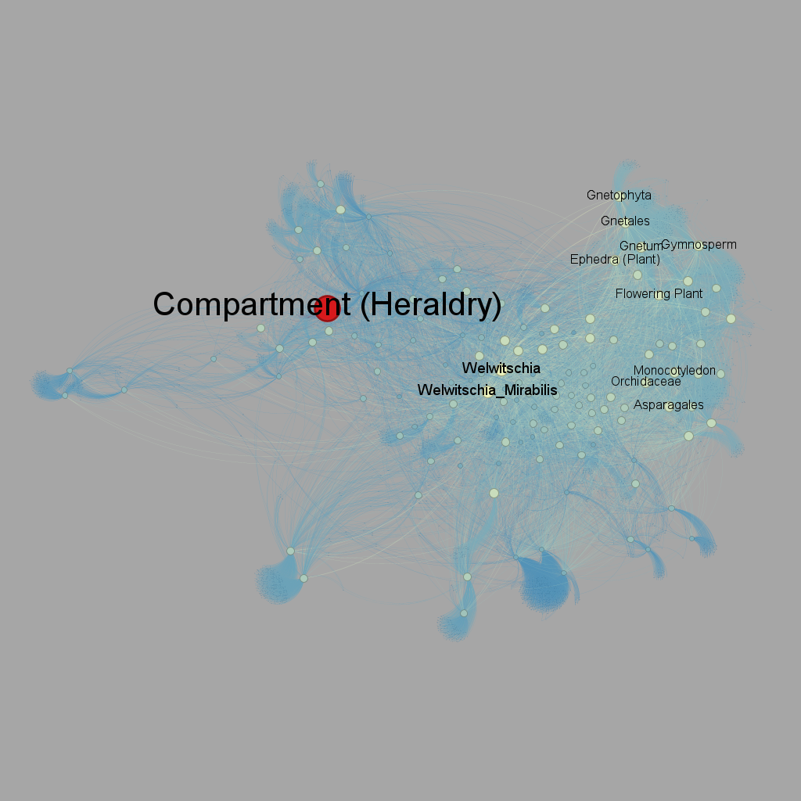
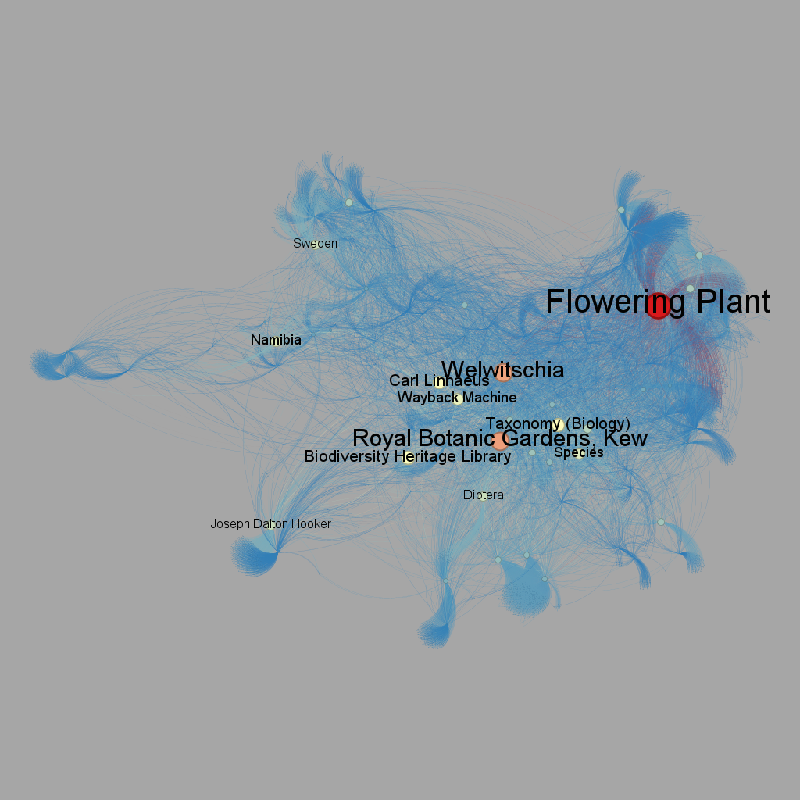
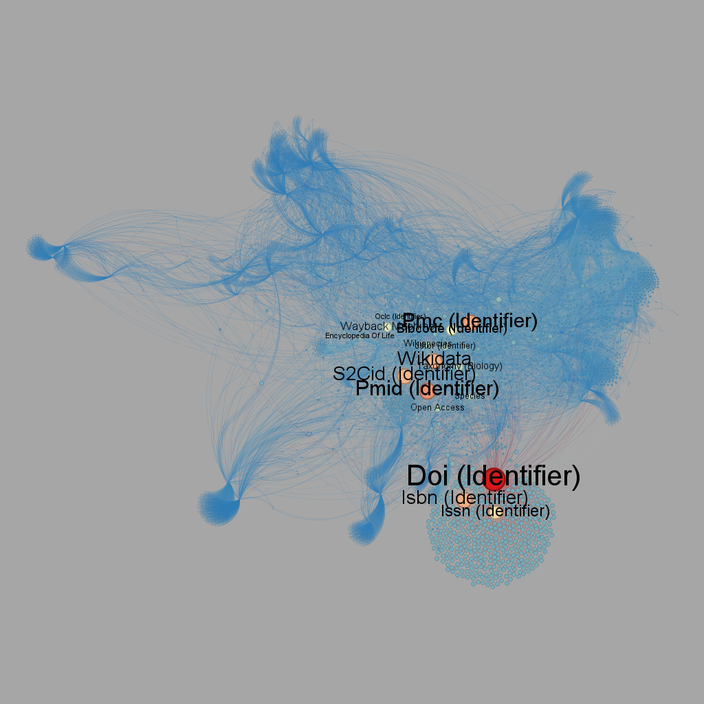
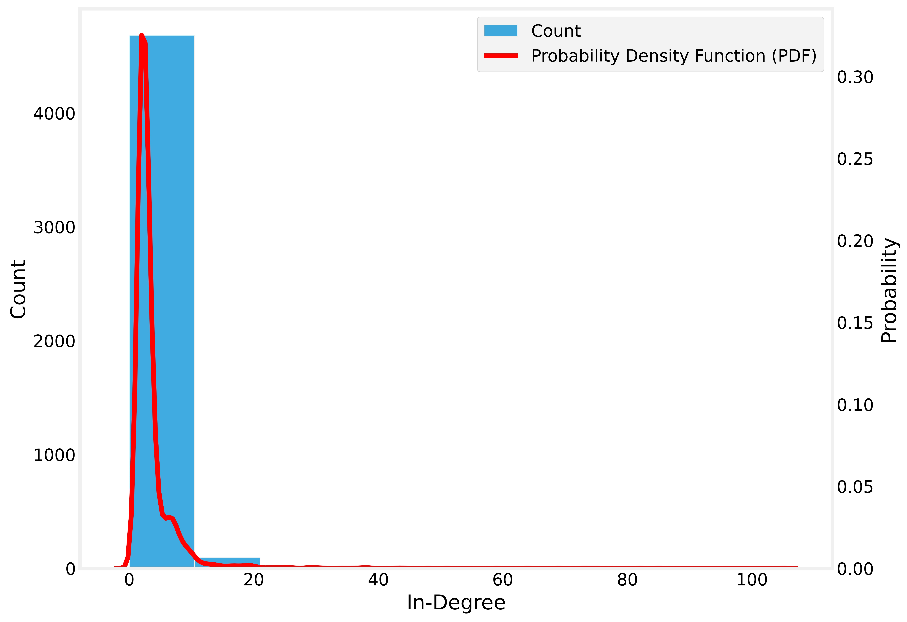
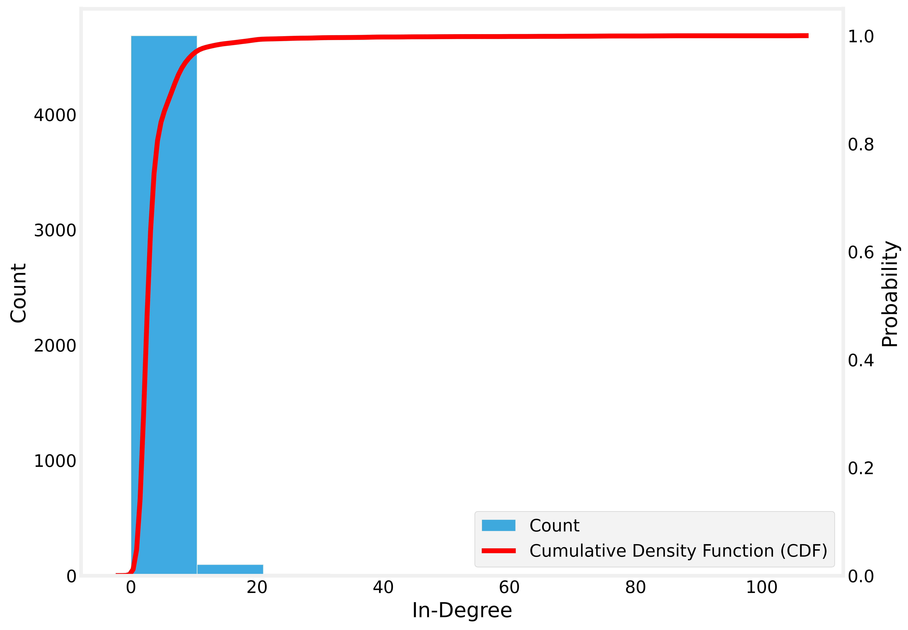
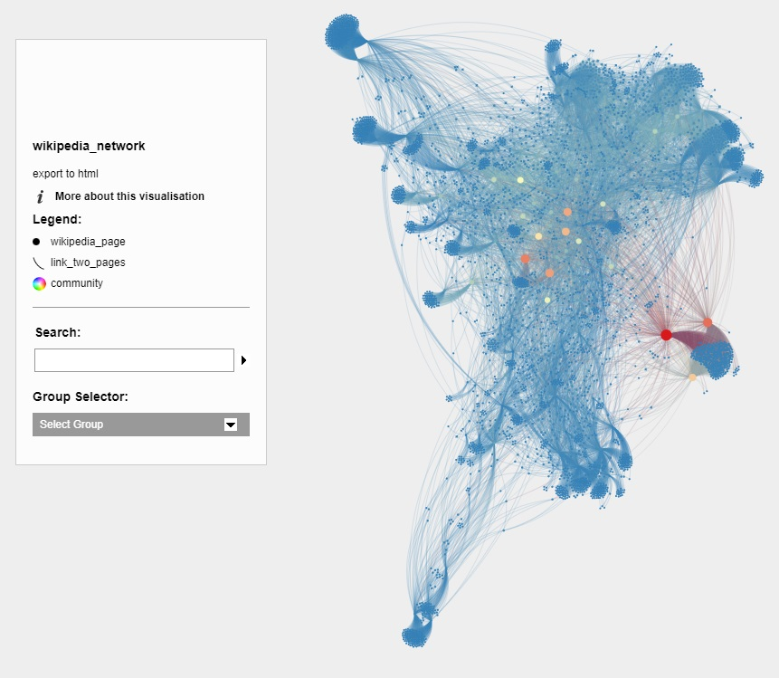

# [Wikipedia Network](https://obyick.github.io/dataStructures_2/)

## Explicação do trabalho em vídeo:
 - [Loom](https://github.com/obyick)

## Requisito 1
- Gerar uma `rede` dirigida a partir dos links das páginas do `Wikipédia` considerando a fusão de 3 `SEEDs`
- Limitar o nível de profundidade da `rede` para 2

As redes escolhidas foram:
- [Dactylorhiza Sambucina](https://en.wikipedia.org/wiki/dactylorhiza_sambucina)
- [Rinorea Niccolifera](https://en.wikipedia.org/wiki/rinorea_niccolifera)
- [Welwitschia Mirabilis](https://en.wikipedia.org/wiki/welwitschia_mirabilis)

Python file:
- [utils.py](https://github.com/obyick/dataStructures_2/blob/master/wikipediaNetwork/utils.py) gera e analisa uma rede a partir de uma página da Wikipedia, produzindo gráficos e resumos

Notebooks:
- [requisite_0.ipynb](https://github.com/obyick/dataStructures_2/blob/master/wikipediaNetwork/requisite_0.ipynb) transforma páginas em redes utilizado a biblioteca da `wikipedia`
- [requisite_1.ipynb](https://github.com/obyick/dataStructures_2/blob/master/wikipediaNetwork/requisite_1.ipynb) importa as `3 redes` e usa o método compose da biblioteca networkx para uní-las em apenas uma

## Requisito 2
- A partir da `rede` construída gerar uma figura similar utilizando o `Gephi`
- Adote um `layout` que seja razoável perceber a diferença entre as cores do vértices

### Paleta de Cores

Uma paleta de cores onde a intensidade do vermelho indica o aumento do valor do atributo.

### Degree Centrality

O *Degree Centrality* é a métrica que contabiliza o número de conexões de um nó.

### Closeness Centrality

O *Closeness Centrality* mede a distância média de um nó para todos os outros nós.

### Betweenness Centrality

O *Betweenness Centrality* avalia o menor caminho entre um nó e outro dentro `rede`.

### Eigenvector Centrality

O *Eigenvector Centrality* quantifica a importância de um nó com base na importância de seus vizinhos.

## Requisito 3
- A partir da `rede` construída gerar uma figura similar considerando o in-Degree dos vértices da `rede`

### Probability Density Function

A Probability Density Function é uma função matemática que descreve a probabilidade de uma variável contínua assumir diferentes valores.

### Cumulative Density Function

A Cumulative Distribution Function é uma função que apresenta a probabilidade acumulada de uma variável aleatória ser menor ou igual a um valor específico.

Notebook:
- [requisite_3.ipynb](https://github.com/obyick/dataStructures_2/blob/master/wikipediaNetwork/requisite_1.ipynb) gera uma figura considerando o in-Degree dos vértices da `rede`.

## Requisito 4
- A partir da `rede` construída gerar uma figura similar no gephi destacando o `k-core` e o `k-shell` da `rede`
- O `layout` é de livre escolha
- Os vértices devem ter um tamanho proporcional a propriedade `in-degree`

Notebook:
- [requisite_4.ipynb](https://github.com/rikdantas/Algoritmos-Estruturas-Dados-II/blob/main/U2T3/source/U2T3_Requisito_4.ipynb). encontra o `k-core` e o `k-shell`

## Requisito 5
- As cores deverão ser relacionadas ao critério de comunidade e o tamanho do vértice a métrica `in-degree`

Página online
- [obyick.github.io/dataStructures_2](https://obyick.github.io/dataStructures_2/) mostra template sigma online

### Wikipedia Network Visualisation

Plugin SigmaExporter para exportar a `rede`.

